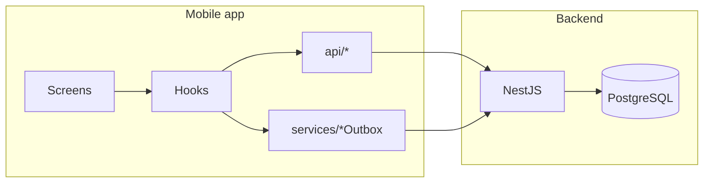

# Silent Protocol

Technical challenge project: a **React Native (Expo)** mobile app and a **NestJS** backend that simulate a surveillance-style mission flow. The app collects mission telemetry (location, Bluetooth, contacts, photos); the API validates and persists it for debriefing and review.

**Disclaimer:** This is an **educational / demo** codebase. Telemetry behavior is intentional for the scenario; do not deploy against real users without explicit consent and legal review.

---

## Contents

- [Architecture](#architecture)
- [Stack](#stack)
- [Repository layout](#repository-layout)
- [Requirements](#requirements)
- [Run locally (recommended for development)](#run-locally-recommended-for-development)
- [Run with Docker Compose (full stack)](#run-with-docker-compose-full-stack)
- [Environment variables](#environment-variables)
- [API and static tools](#api-and-static-tools)
- [Mobile ↔ API connectivity](#mobile--api-connectivity)
- [Main HTTP surface](#main-http-surface)
- [Implementation notes](#implementation-notes)
- [Quality checks](#quality-checks)
- [Optional: local Android APK](#optional-local-android-apk)

---

## Architecture

At a high level:

1. **Mobile** keeps HTTP usage behind `mobile/src/api/` (`http.ts`, `agents.ts`, `intelligence.ts`). Shared request/response shapes live in `mobile/src/api/contracts.ts`.
2. **Offline / flaky network:** telemetry is queued in `mobile/src/services/*Outbox` and flushed when the backend is reachable.
3. **Location:** foreground sampling and background task (`mobile/src/location/`) feed the same pipeline (dedupe, local mirror, outbox, batch upload).
4. **Backend:** Nest modules `agents` (profiles, status, read APIs) and `intelligence` (telemetry ingest). PostgreSQL access is via `pg` (no ORM). Media files are stored on disk under `uploads/` and served under `/uploads/`.



---

## Stack

| Layer    | Technology                          |
| -------- | ----------------------------------- |
| Mobile   | React Native (Expo), TypeScript     |
| Backend  | NestJS, TypeScript, `pg`            |
| Database | PostgreSQL 16 (Compose image)       |
| Dev ops  | Docker Compose                      |

---

## Repository layout

```text
.
├── backend/
│   ├── public/              # Static assets (agent tracker)
│   └── src/
│       ├── agents/          # Agent CRUD, status, debrief reads
│       ├── intelligence/    # Telemetry ingest (locations, scans, contacts, media)
│       ├── database/        # PostgreSQL pool
│       └── common/          # Shared constants and errors
├── mobile/
│   └── src/
│       ├── api/             # HTTP client, contracts, config
│       ├── components/
│       ├── features/        # Session / mission domain helpers
│       ├── hooks/
│       ├── location/        # Background task, payloads, dedupe, telemetry helpers
│       ├── screens/
│       ├── services/        # Outbox + delivery
│       ├── storage/
│       └── utils/
├── database/
│   └── init.sql             # Schema + seeds (mounted into Postgres on first boot)
├── docker-compose.yml
├── .env.docker              # Example for Compose (copy to `.env`)
└── .env.example             # Root env hints (see Environment variables)
```

---

## Requirements

- **Node.js** 20+
- **npm**
- **Docker** + **Docker Compose** (for Postgres, or full stack)

---

## Run locally (recommended for development)

### 1. Database

From the repository root:

```bash
cp .env.docker .env
docker-compose up -d database
docker-compose ps
```

`database/init.sql` runs automatically on first container initialization.

### 2. Backend

```bash
cd backend
cp .env.example .env   # adjust if your Postgres creds differ
npm install
npm run start:dev
```

Default API base URL: **http://localhost:3000**

Ensure `DB_*` in `backend/.env` matches the Postgres service (`localhost`, port from `POSTGRES_PORT` in root `.env`, usually `5432`).

### 3. Mobile

```bash
cd mobile
npm install
npx expo start
```

Then run on Android emulator, iOS simulator, or device (Expo Go / dev client). For Android emulator against a host backend, the app defaults to **http://10.0.2.2:3000** when no `EXPO_PUBLIC_API_URL` is set.

---

## Run with Docker Compose (full stack)

Builds and runs **database**, **backend**, **mobile (Expo web)**, and an optional **ngrok** sidecar (requires `NGROK_AUTHTOKEN`).

```bash
cp .env.docker .env
# Edit .env: set EXPO_PUBLIC_API_URL for how the browser reaches the API (often http://localhost:3000)
docker-compose up --build
```

- **API / docs / agent tracker:** see [API and static tools](#api-and-static-tools).
- **Expo web:** port **19006** by default (`FRONTEND_PORT`).
- **Ngrok inspector:** [http://localhost:4040](http://localhost:4040) when ngrok is configured.

---

## Environment variables

| Location | Variable | Purpose |
| -------- | -------- | ------- |
| **Root `.env`** (Compose) | `POSTGRES_DB`, `POSTGRES_USER`, `POSTGRES_PASSWORD` | Postgres credentials |
| | `POSTGRES_PORT` | Host port mapped to Postgres (default `5432`) |
| | `BACKEND_PORT` | Host port for API (default `3000`) |
| | `FRONTEND_PORT` | Host port for Expo web (default `19006`) |
| | `EXPO_PUBLIC_API_URL` | Base URL injected into the **frontend** Compose service |
| | `NGROK_AUTHTOKEN` | Enables ngrok container (optional) |
| **`backend/.env`** | `PORT` | HTTP listen port (default `3000`) |
| | `DB_HOST`, `DB_PORT`, `DB_NAME`, `DB_USER`, `DB_PASSWORD` | PostgreSQL connection |
| | `DB_POOL_MAX`, `DB_RETRY_ATTEMPTS`, `DB_RETRY_DELAY_MS` | Pool and startup retry behavior |
| | `CORS_ORIGINS` | Comma-separated origins or `*` (default in `main.ts` includes common Expo dev URLs) |
| **`mobile/.env`** (optional) | `EXPO_PUBLIC_API_URL` | Overrides automatic dev URL detection |

Copy examples: **`.env.docker`** (Compose), **`backend/.env.example`**, **`mobile/.env.example`**.

---

## API and static tools

With the backend running (e.g. `http://localhost:3000`):

| Resource | URL |
| -------- | --- |
| **Swagger UI** | [http://localhost:3000/docs](http://localhost:3000/docs) |
| **Agent tracker** | [http://localhost:3000/agent-tracker.html](http://localhost:3000/agent-tracker.html) |
| **Root `/`** | Redirects to `agent-tracker.html` |

Static tracker source: `backend/public/agent-tracker.html`.

---

## Mobile ↔ API connectivity

| Context | Suggestion |
| ------- | ---------- |
| **Android emulator** | Default `http://10.0.2.2:3000` is usually correct. |
| **Physical device (same LAN)** | Set `EXPO_PUBLIC_API_URL=http://<your-pc-lan-ip>:3000` in `mobile/.env`. **Do not** use `localhost` — it refers to the phone. |
| **Tunneling (e.g. ngrok)** | Point `EXPO_PUBLIC_API_URL` at the public HTTPS URL. The HTTP client sets `ngrok-skip-browser-warning` when the host looks like ngrok. |

---

## Main HTTP surface

| Method | Path | Role |
| ------ | ---- | ---- |
| `GET` | `/agents` | List agents (paginated, optional status filter) |
| `POST` | `/agents` | Create agent |
| `PATCH` | `/agents/:id/status` | Mission status |
| `GET` | `/agents/:id/summary` | Debrief summary + counts |
| `GET` | `/agents/:id/locations` | Location telemetry |
| `GET` | `/agents/:id/bluetooth-scans` | Bluetooth scans |
| `GET` | `/agents/:id/contacts-leaks` | Contacts leak records |
| `GET` | `/agents/:id/visual-evidence` | Media metadata + URLs |
| `POST` | `/intelligence/locations` | Batch location ingest |
| `POST` | `/intelligence/scans` | Batch Bluetooth ingest |
| `POST` | `/intelligence/contacts` | Batch contacts ingest |
| `POST` | `/intelligence/media` | Multipart media upload |

Request/response schemas: **Swagger** at `/docs`.

Paginated list shape:

```json
{
  "items": [],
  "limit": 100,
  "offset": 0,
  "has_more": false
}
```

---

## Implementation notes

- Request bodies are validated with DTOs and Nest’s `ValidationPipe` (`whitelist`, `transform`).
- Telemetry persistence uses PostgreSQL via `pg` (no ORM); schema in `database/init.sql`.
- Mobile location capture uses Expo Location and a background task where the platform allows.
- Mission flow supports **offline-friendly queues** and sync when the API is reachable.
- App UI strings are **Portuguese** (`mobile/src/i18n`); this README stays in **English** for technical review.

---

## Quality checks

**Backend** (ESLint):

```bash
cd backend
npm run lint
npm run build
```

**Mobile** (TypeScript, noEmit):

```bash
cd mobile
npm run typecheck
```

> The mobile package also exposes `npm run lint`, which currently runs the same TypeScript check as `typecheck`.

---

## Optional: local Android APK

```bash
cd mobile
npx expo prebuild --platform android
npm run build:apk:local
```

On Windows, if file locks break `prebuild`:

```bash
npm run prebuild:android:safe
npm run prebuild:android:after-restart
```

---

*Silent Protocol — demo / interview portfolio piece.*
